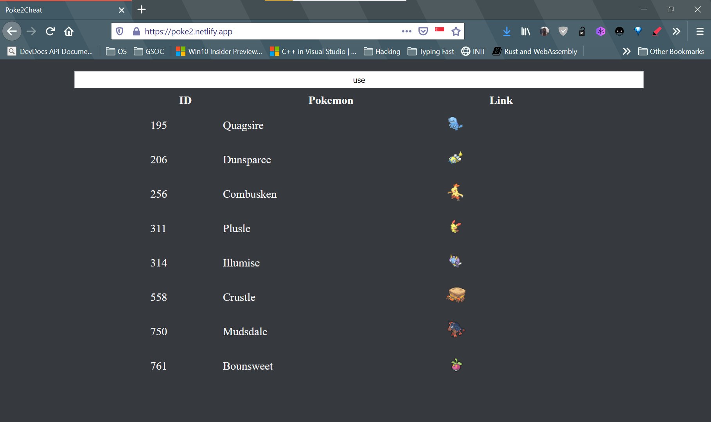

# poke2cheat

Enter partial name, get full name of pokemon

No less than that, **The name matching logic is basically regex, you match all names in the list with this regex**

The name is so since it is based from the idea that some quizes like from Poke2 discord app, gives you hints like name is _u__s_e, and you have to provide its full name,
so i call it 'poke2cheat'.

